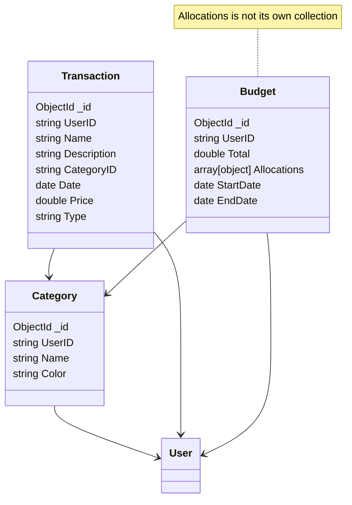

## Database Diagram

```mermaid
classDiagram
    class Category{
		    ObjectId _id
        string UserID
        string Name
		string Color
    }
    
    class Transaction{
		    ObjectId _id
		    string UserID
		    string Name
		    string Description
		    string CategoryID
		    date Date
		    double Price
		    string Type
    }
    
    class Budget{
		    ObjectId _id
		    string UserID
		    double Total
		    array[object] Allocations
		    date StartDate
		    date EndDate
    }

    note for Budget "Allocations is not its own collection"
    
    Category --> User
    Transaction --> User
    Transaction --> Category
    Budget --> User
    Budget --> Category
```
